 # 音乐播放管理系统
## 项目介绍
本项目是基于 **JSP + Servlet + MySQL** 开发的 Java Web 音乐播放平台，主要用于实现用户在线听歌、歌曲收藏、歌手分类、个人歌单、ai系统管理等功能，适合作为课程设计、毕业设计或 Java Web 入门实战项目，帮助学习前后端交互、数据库操作及 Web 项目完整开发流程。

## 项目演示

###  测试账号信息

**项目在线测试地址 [点我有惊喜!](http://47.118.16.58:8899/login.jsp)**

> **注意：管理员为了更好的管理，暂时关闭了注册功能，你想体验注册功能的话：下载压缩包**

为了方便快速体验系统功能，我们提供了以下预设测试账号(开通的账号)：
| 账号类型 | 用户名 | 密码 |
| :--- | :--- | :--- |
| **测试用户** | `yt_xc` | `yt_music_123456` |

### 登入
---
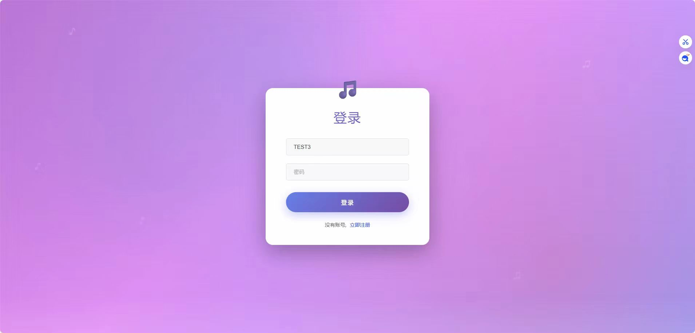

### 注册
---
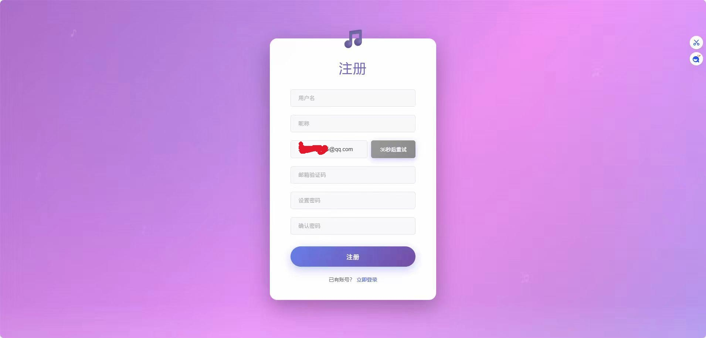

### 首页
---
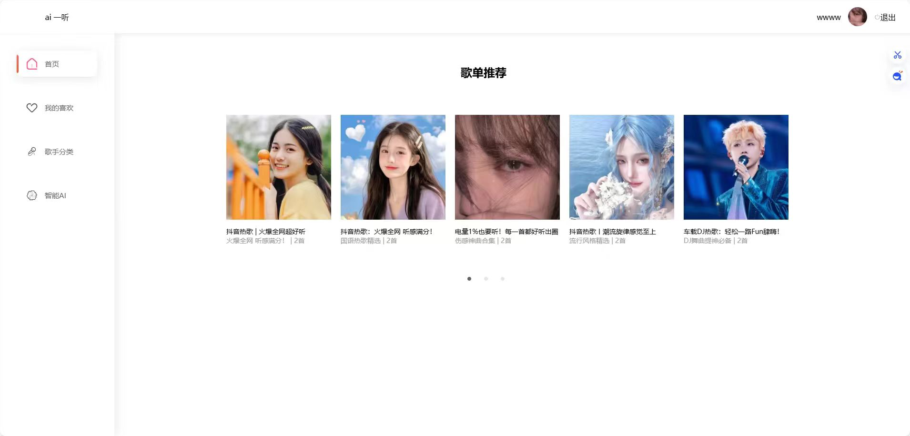

### 喜欢
---
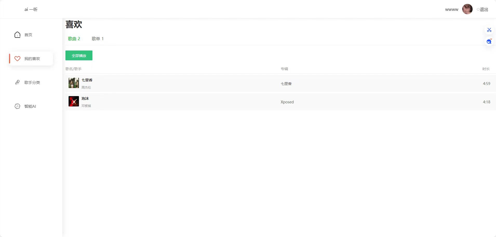

### 歌手分类
---
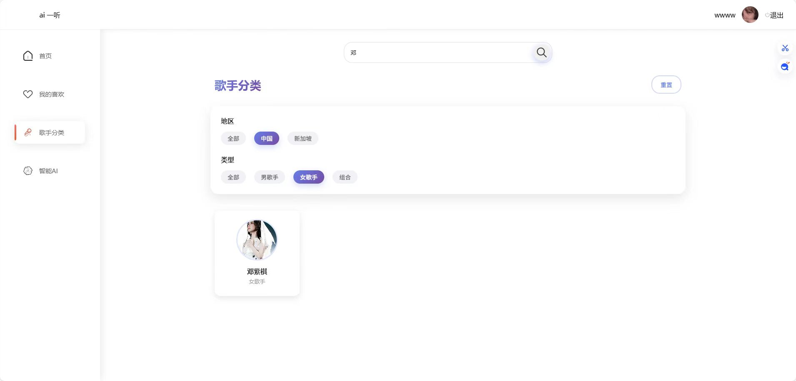

### 歌手详情
---
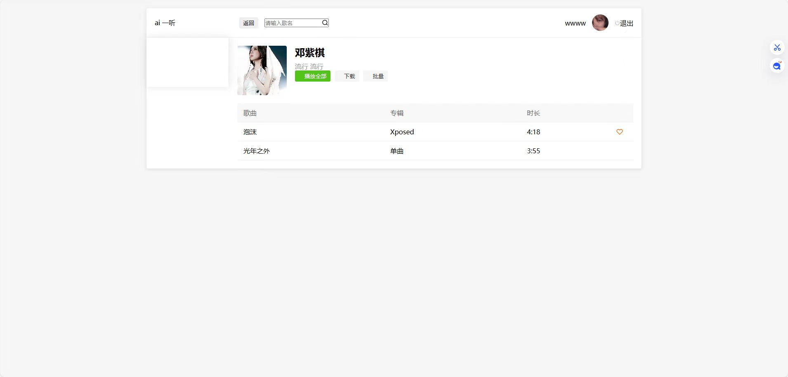

### —听ai
---
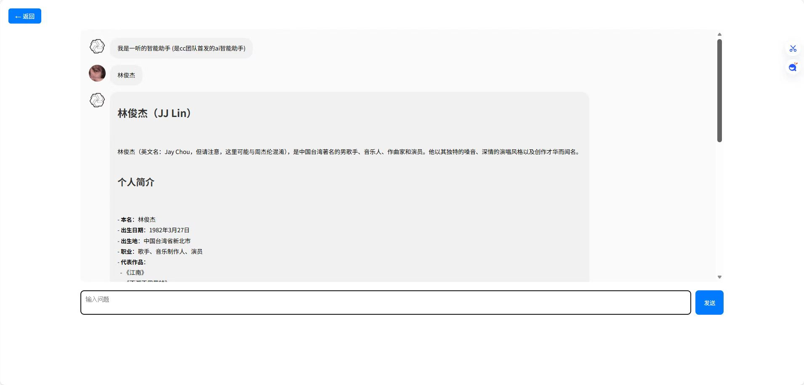

### 播放
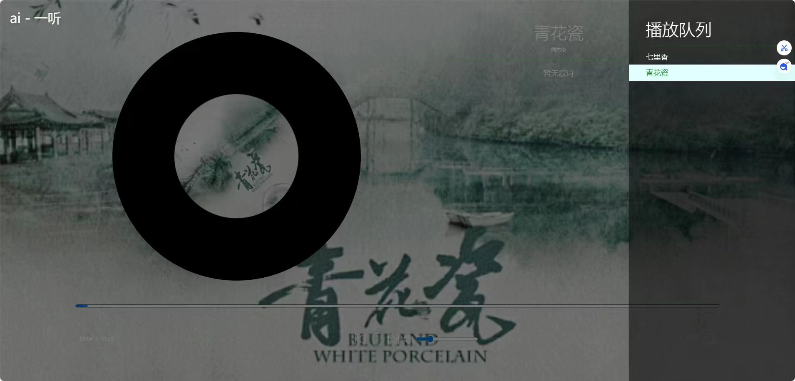

### 歌单详情
---
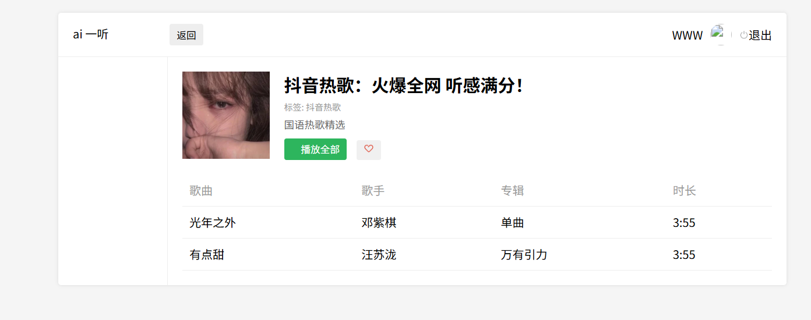

### 数据库ER图（实体-关系图）
---
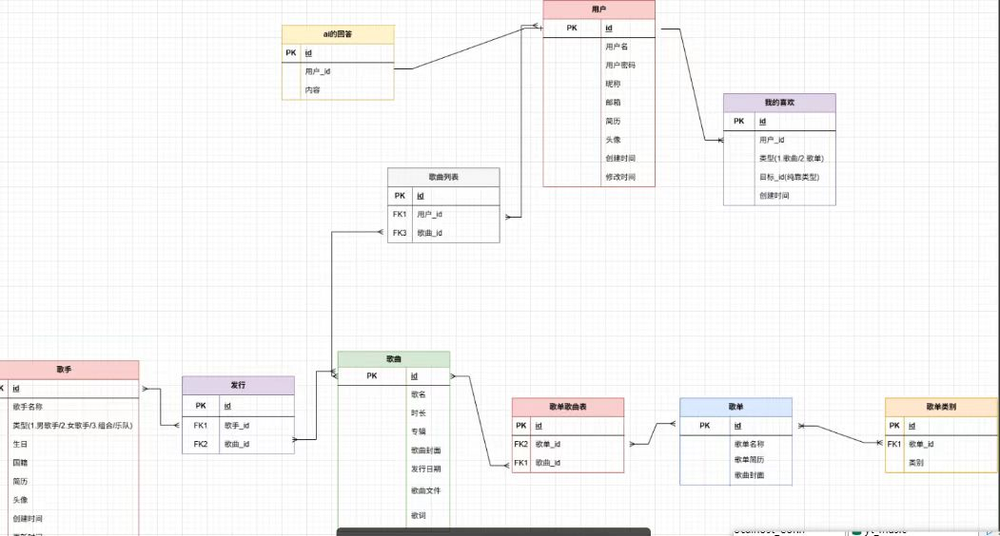

## 使用方法
### 1. 搭建运行环境，安装 JDK、Tomcat 和 MySQL，创建数据库并执行项目中的 SQL 脚本初始化数据表。
####  环境要求

| 软件/组件 | 版本要求 | 说明 |
| :--- | :--- | :--- |
| **JDK** | 1.8 ~ 17 | 支持 Java 8 到 Java 17 的版本 |
| **Tomcat** | 8.x ~ 10.x | 建议使用 Tomcat 9 或 10 |
| **MySQL** | 8.x | 需创建数据库并执行 SQL 脚本初始化 |

####  快速开始

1. **搭建运行环境**：安装上述表格中的 JDK、Tomcat 和 MySQL。
2. **初始化数据库**：
   - 在 MySQL 中创建一个新的数据库。
   - 执行项目中的 SQL 脚本（通常位于 `sql/` 或 `database/` 目录下）以初始化数据表。
3. **部署项目**：将项目打包并部署到 Tomcat 服务器。
4. **启动服务**：运行 Tomcat，访问 `http://localhost:8080/你的项目名`。
---  
### 2. 修改数据库连接配置文件(application.properties)，将用户名和密码改为本地环境信息,修改邮件服务配置和其他配置(ai大模型接口)，启动 Tomcat 服务器后通过浏览器访问项目地址即可使用。
###  配置说明

在启动项目前，必须根据您的本地环境修改配置文件。

**配置文件路径：**
`src/main/resources/application.properties`

请使用编辑器打开该文件，并修改以下关键配置项：

#### 1. 数据库连接配置 (JDBC)
请确保 MySQL 服务已启动，并替换为您的本地数据库信息。

| 配置项 | 说明 | 示例值 |
| :--- | :--- | :--- |
| **`username`** | 数据库登录用户名 | `root` |
| **`password`** | 数据库登录密码 | `123456` |
| **`url`** | 数据库连接地址 | `jdbc:mysql://localhost:3306/你的数据库名?serverTimezone=UTC&useSSL=false` |

> **注意**：请确保 URL 中的 `你的数据库名` 已替换为您在 MySQL 中实际创建的数据库名称。

#### 2. 邮件服务配置 (Mail)
如果项目包含注册验证或邮件发送功能，请填写您的邮箱授权信息。

- **`fromEmail`**: 您的发件邮箱地址 (例如: `example@qq.com`)
- **`EmailPassword`**: 邮箱的 **SMTP 授权码** (注意：不是登录密码，请在邮箱设置中获取)

#### 3. 其他配置
- **`API_KEY`**: 填写您的 AI 接口密钥。
- **`MODEL`**: 指定使用的 AI 模型版本 (如 `qwen-turbo`)。
- **`Whitelist`**: 配置免登录访问的路径，多个路径用逗号分隔。

-

###  启动与访问

1. **部署项目**：
   将项目导入 IDE (IntelliJ IDEA)，并配置 Tomcat 服务器。
2. **启动服务器**：
   运行 Tomcat，观察控制台日志确保无报错。
3. **访问项目**：
   打开浏览器，访问以下地址（端口号请根据您的 Tomcat 配置调整）：
   
> **[http://localhost:8080/你的项目名/Player.jsp](http://localhost:8080/你的项目名/Player.jsp)**
---

## 后续版本演示
> **注意:点击图片,即可进入视频入口，下载并播放,很抱歉githua不支持在线播放**
[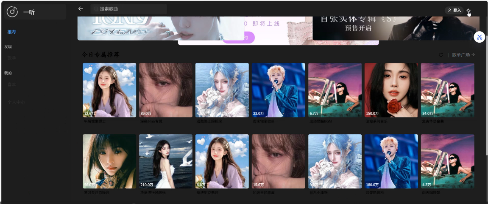](img/版本2.0.mp4)
